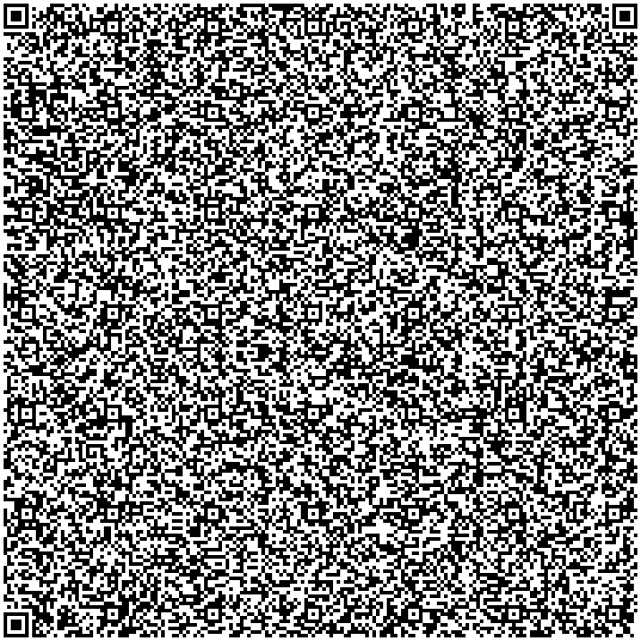

<h1 align="center">Scramble</h1>

<p align="center">Your Digital Paper Shredder which fits in a qr code.</p>

<table align="center">
<tr>
    <td>
      <p align="center"><b>QR Code</b></p>
    </td>
  </tr>
  <tr>
    <td align="center">
      <br/>
      
      <br/><br/>
    </td>
  </tr>
  <tr><td><p align="center">Scan the QR code to access the app</p></td></tr>
</table>

Alternatively copy and paste the following data URL in your browser, which is what the QR code contains
```url
data:text/html;charset=utf-8,%3Cbody%3E%3Cscript%3Enew%20Response(Uint8Array.from(atob(%22jVVrj9u4Ff0rWg12IQYUbU%2BelUy13aQFttg2ixT5ZPgDRV7ZzFCkQF7Z4xr%2B7wUpeWZ2km0KAxaf955z7oPrHlBk0lkEizw%2FaoV7ruCgJZRpQrXVqIUpgxQG%2BCrPrOiBHzQcB%2BexWQc8GWhenHvhd9pWy7p1XoFPg%2Fsy6P9ou6umtbJ193XnLJad6LU5VeEUEPpy1DQIG8oAXneX1qnTude23IPe7bFaLZfqsK%2BVDoMRp6ozcF%2FHv1JpDxK1s5V0ZuxtvRNDdeuhr7%2BMAXV3KmdelQSL4Gth9M6WGqEP16VBKBUBrjz0lxt5OPfifiIe%2Ff44kym9UHoMFXsdrbsRjbZQrYb7LDijVXajXsXf5aY7%2F58wkz9m2ofzrXHyrp5ELFuH6PrZnXTG%2Berm9k38JfmqN8tlFi0sVuz1henzE8BXQt%2BB%2BpzYy7evEyJdVeUR2juNZacNlONgnFBlOyI6exbDAMILK6GyzkItRx%2Bcrwank5iPkRfybufdaFV1s3z55k9idWXRdd3vISYeV94%2BBXyC%2Fgzg7YSv%2FUOuk6HniP4nkK%2B0%2FLYqNXphg04hZKvXIQMR4MLaau8O4M%2B%2F83H77pV8e7kR8iGwSajvJMJfelBaZEXM%2Bonf2zfvhntyTrVwpfkyHv3G2dXydvnV4aTGM7feHb8qjTAICaVI%2BJ8VwO275HC9mEp8LYU9iJBpxeWhWS%2BmabPunO%2FjYteslT40ayNaMJk0IgRu2qxznuvm%2Fd65AJmw2S%2B92MF6kU412VrbYcRMSAkDch33Fi%2Fmyzpa1VO%2F0RmeBuAxJ5v1IvmZcnI%2B2077YWx7jc2n0a4X034Cle21UmCjPSG%2FfXNe04or3XxwRxvz%2Fgr2auo7F9Xjxd%2F0PZjsg0DxeHuCvYh6NesgvR6w6UabYpMdCyBnA5hZDsyA3eGeYt05X9TLH7itCfJ%2FCtyzzjjnizT0wirXF%2BSFJdSWJd3Axm4pbHC75Zv4oXFhW3vA0dsMLg%2FO9gVQy3OVkzNk2gaMJe267O%2FawE8%2FFRFCVJ0Ct3DMfjauLTawpedIuAIWPxdC6ggX%2BedPvzLpQSB8bL%2BAxM%2Bffi2AUMGVk2MPFufdvxmIsyIXObliEmzvoeNIBVOzdNxSwaTR8q4gNNr2cHB3T2wjoWesflheLtLZgBnwUORdTqiNA3nIZ2BUcMt2gO9jpt9jkd%2BqnNQPGoQo%2BAzjAekOcIb58%2BkXVQC5hCLXOWHOyr2wO%2BDAm%2FPEGxgKvwNkMSnDZrmlJsmVcqY2LHj5TW2QUMPcxDVas2x6dc30pZZNDx838yCK48Ux2S0MXdIluVwoMGendOcinKzMoi1gg4cDWPwAnRgNFpMWhs80HqDKJ1DlH0I1hMor1OSkILw5Y7r7seuC9AD2feoDhZzhyxn15Bk4Po8BPZsYPVLDE1oy0ZrBQryS1mMBFUu6pDhbx6t16vhfvRcn1nnXF4YpgYIwD2qUUMT0pkh4U%2BCPrzhf%2FhnYMIZ9sbFbUsHmWmDlajutW0KB0M2W1I4fCzfh8I8SJRhx9llbfPfeiH4AldwXjnVGYEHI1xBT9SYRMtdljkwgWQAsgNTXsOPzsONj2IfxiQw%2BSURDkQuZE5aaMptfGZ7HVp9fLnFbzQkba%2BhJ2PaFOAqNWeTxm3e9DlAAbyxDlyocCKF5kF70rQHFBrvLyWRPPbEHydJjW%2FjHvz%2F%2BiwX02u50dyocubaJXAyD0VLEYlt8Cc7mF0LzIfbFwNKcxKdlaoP%2FBQ%3D%3D%22)%2C(e%3D%3Ee.charCodeAt(0)))).body.pipeThrough(new%20DecompressionStream(%22deflate-raw%22)).getReader().read().then(((%7Bvalue%3Ae%7D)%3D%3E(document.open()%2Cdocument.write((new%20TextDecoder).decode(e))%2Cdocument.close()))).catch(console.error)%3C%2Fscript%3E
```

## Author
[Arnav Kumar](https://github.com/arnav-kr)

## License
This project is licensed under the AGPL-3.0 License - see the [LICENSE](LICENSE) file for details
